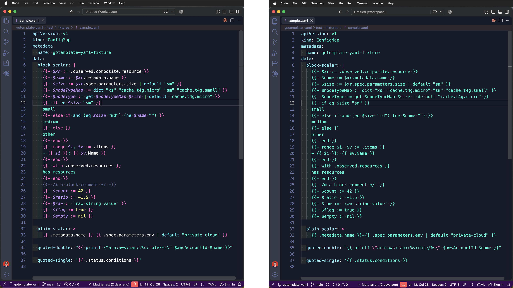

Syntax highlighting for Go template expressions inside YAML, including block scalars.

YAML has no idea what `{{ }}` means, so a template in a manifest renders as one flat string and a typo looks exactly like correct code. Built for [Crossplane](https://crossplane.io) compositions using [function-go-templating](https://github.com/crossplane-contrib/function-go-templating); Helm and Argo templates get the same treatment.

## Install

```
code --install-extension cujarrett.gotemplate-yaml
```

It injects into `source.yaml`, so every YAML file is covered with no configuration. Colors come from your theme.

Highlighting is lexical. It shows you where the code is, not whether it is correct.

## Develop

`package.json` plus one TextMate grammar, no runtime code. `just lint`, `just build`, `just run` to install locally.
